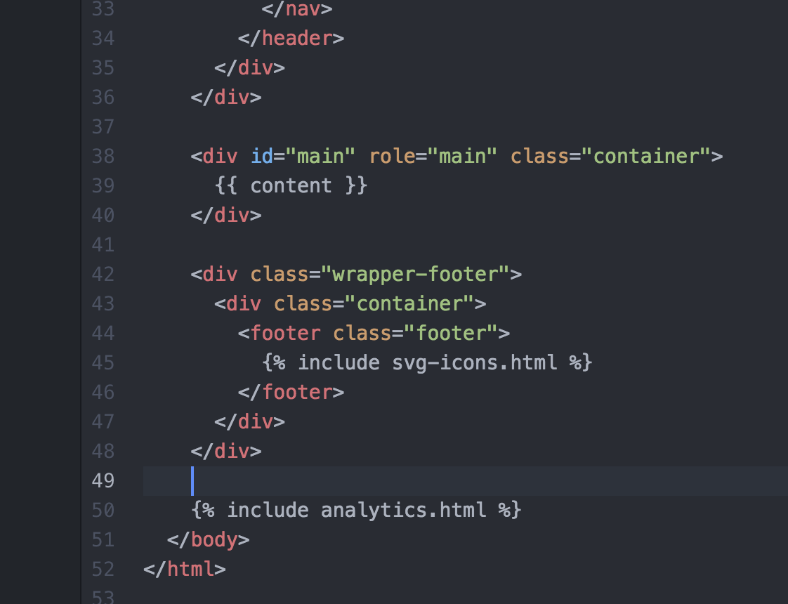
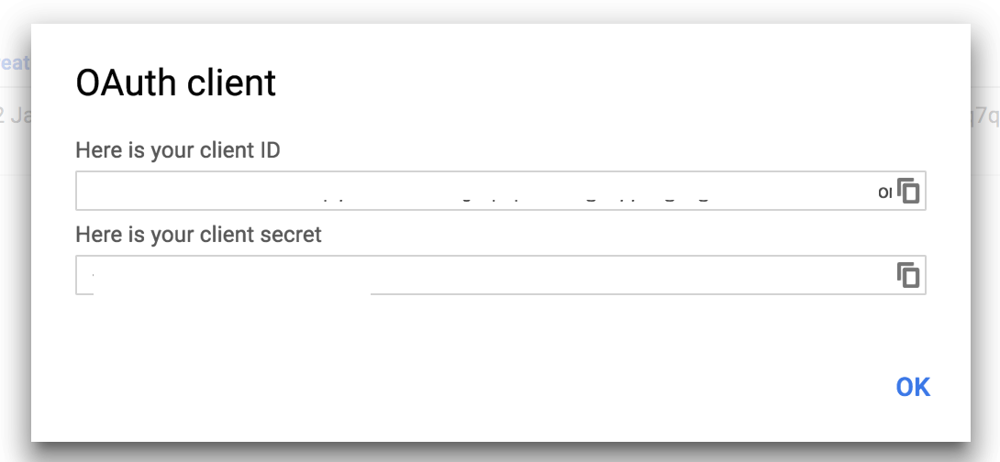

### Introduction

Google’s developer console has several APIs that can be customized and used for a plethora of development tasks. Some popular APIs include, the Google Maps, Google Cloud, Google Apps and the Google Analytics API. The Google Analytics API provides structured data analytics and reporting tools for clients. For example, with the analytics API, it is possible to access a website’s total bounce rates, popularity, global traffic, and traffic peaks. `Jekyll` is a blog post template system for GitHub. I will be incorporating the analytics API with my Jekyll blog template and then access the Google Analytics in RStudio with the `rga` package.

In order to collect the data from the API and work with it programmatically, we can use the R package, `rga` - R Google Analytics.

I'll being by setting up the basic requirements in Google Developer Console to access the Google Analytics API:

#### Step 1: Set up a Google Analytics Account

Ensure you have a google account (i.e. Gmail account) as it will be required before proceeding any further. I logged into my google account and proceeded to the [Google Analytics website](https://analytics.google.com/analytics/web/?authuser=0#management/Settings/a90661696w134530349p138597581/%3Fm.page%3DTrackingCode%26_r.ghFlowId%3D6324039/) and created the analytics profile that I want to request data from. Main features to consider are the `Account name` (which would contain the tracking id needed to connect the website to API), `Website name` and `Website URL` (that would be my website url that I want to track).


#### Step 2: Set up Analytics with Jekyll

I am using Jekyll to create my blog posts and I would like to perform analytics on my blogs. In order to do so, I will be modifying some of the code in the Jekyll default template so that the google-analytics can communicate with my blog traffic data.

In the forked Jekyll template repository, I opened the `_includes` folder and created `analytics.html` with the following JavaScript code inside (from the google analytics tracking id). I obtained the `tracking id` from the `Admin` tab of the analytics account I created.


```
<script>
  (function(i,s,o,g,r,a,m){i['GoogleAnalyticsObject']=r;i[r]=i[r]||function(){
  (i[r].q=i[r].q||[]).push(arguments)},i[r].l=1*new Date();a=s.createElement(o),
  m=s.getElementsByTagName(o)[0];a.async=1;a.src=g;m.parentNode.insertBefore(a,m)
  })(window,document,'script','https://www.google-analytics.com/analytics.js','ga');

  ga('create', 'UA-90661696-1', 'auto');
  ga('send', 'pageview');

</script>
```


Then, in the `_layouts` folder, I opened the `default.html` file and added the following tag so that all the blog posts can be tracked by Google Analytics:

```

```



Once the JavaScript tag is added, Google Analytics will be able to communicate with the website and allow traffic data to be recorded.


#### Step 3: Access the Google Developer Console


I navigated to the [Google Developer Console](https://console.developers.google.com/apis/library) and searched for the `Analytics API` under the menu `Other popular APIs`. On the top right hand corner, I clicked on the `Create New Project` since it was my first time working with any google APIs.


#### Setting up a new project for Analytics API

 I configured my project with a descriptive name and agreed to the `terms and conditions` check box. A project ID was  displayed below the project name.  Finally, I clicked `create` to commence the analytics project.

 

#### Step 4: Creating Credentials

In this part, I will be setting up the authentication keys, so that I will be able to access the Google Analytics API from R.  On the left hand panel, I clicked on the `Credentials` menu and under the `Credentials` tab, I selected `Create Credential`, which then dropped down with three menu options, and I selected the `OAuth Client Id`. On the next screen I selected `others` for usage type. When prompted to name a product name, I clicked on the prompt message link to select a product name for the profile (in my case, I used `Google Analytics with R` as the product name).

Now I navigated back to the `Application Type` menu, where I selected `other`, and and chose an appropriate name. I decided to keep my naming consistent and named my `Client ID` as `Google Analytics with R`.

I now had a `client-id secret` and a `client-id url`. Both of which will be required when authenticating using R.



#### Step 5: Setting up a Google Analytics View

I will be using the default [GA Dev Tools Analytics Viewer](https://ga-dev-tools.appspot.com/query-explorer/), but you’re welcome to select any other application you would like to work with. The basic idea behind a viewer is to select a website to perform various queries to obtain specific data.


#### Step 6: Connecting to R using rga

I was finally able to proceed to connecting google analytics with R, using `rga` package. I installed the package with R command `install.packages("RGA")` and loaded the library with `library(RGA)`. I then pasted the authenticating keys and the view keys into an R variable `token`.

```
# Authenticate Google Analytics
token <- authorize(client.id = "Hidden client key", client.secret = "secretkey Hidden")


getData <- get_ga(token, profileId = "view id hidden", start.date = "15daysAgo",
       end.date = "yesterday", metrics = c("ga:sessions"," ga:pageviews"),
       dimensions = "ga:date", sort = NULL, filters = NULL, segment = NULL, samplingLevel = NULL, start.index = NULL,
       max.results = NULL, include.empty.rows = NULL, fetch.by = NULL)
```

Finally, here is a simple plot I created from the data retrieved from google analytics API (Note: since my blog website has zero views, I did not get a very useful graph). The purpose of this was to show how easy it is to obtain website analytics data from the API to the R console within minutes for further statistical analysis. 

```
#plot data

ggplot(getData, aes(date, pageviews))+geom_line()
```


